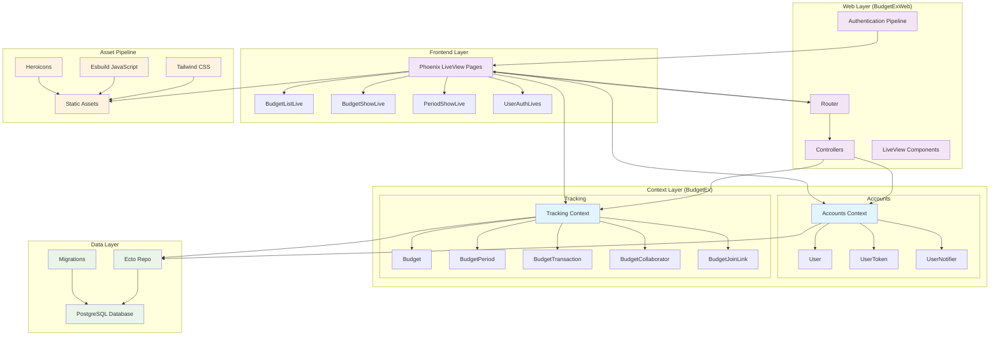

# BudgetEx

A collaborative budget tracking application built with Phoenix LiveView and Elixir.

## About

This project is based on the YouTube playlist tutorial series by [Christian Alexander](https://github.com/ChristianAlexander) available at:
https://youtube.com/playlist?list=PL31bV6MaFAPllC8JP0vaRKrVm5kj7c1vc

## Architecture



## Features

- **User Authentication**: Registration, login, password reset with email confirmation
- **Collaborative Budgets**: Create budgets and invite collaborators via shareable links
- **Budget Periods**: Organize budgets into time-based periods (monthly, quarterly, etc.)
- **Transaction Management**: Track income and expenses within budget periods
- **Real-time Updates**: LiveView provides real-time collaboration without page refreshes
- **Responsive Design**: Built with Tailwind CSS for mobile-friendly interface

## Getting Started

### Prerequisites

Make sure you have PostgreSQL running. You can use Docker Compose to start a PostgreSQL instance:

```bash
docker compose up postgres
```

### Setup and Run

To start your Phoenix server:

  * Run `mix setup` to install and setup dependencies
  * Start Phoenix endpoint with `mix phx.server` or inside IEx with `iex -S mix phx.server`

Now you can visit [`localhost:4000`](http://localhost:4000) from your browser.

Ready to run in production? Please [check our deployment guides](https://hexdocs.pm/phoenix/deployment.html).

## Learn more

  * Official website: https://www.phoenixframework.org/
  * Guides: https://hexdocs.pm/phoenix/overview.html
  * Docs: https://hexdocs.pm/phoenix
  * Forum: https://elixirforum.com/c/phoenix-forum
  * Source: https://github.com/phoenixframework/phoenix
